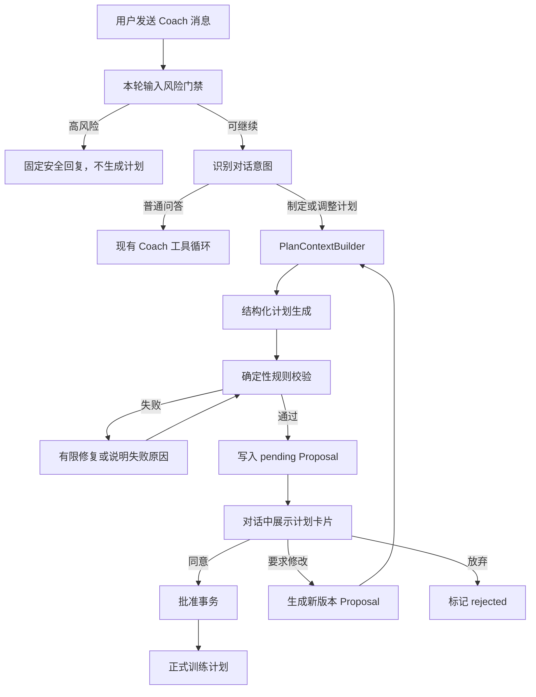

# FitFlow AI 对话式训练计划升级方案

> 更新日期：2026-08-08  
> 状态：方案草案  
> 关联计划：[FitFlow AI 秋招分步开发计划](./fitflow-ai-autumn-development-plan.md)

## 1. 方案结论

这次升级不新增第二个自由运行的 Agent，也不让 Coach 直接保存正式训练计划。推荐沿用现有的单 Agent、工具白名单和 Proposal 审批边界，再增加一个受控的计划生成工作流。

完整流程如下：

1. 用户在 Coach 中提出计划需求，例如“帮我制定下周的训练计划”。
2. 后端先检查本轮输入和用户画像的健康风险。
3. Coach 判断这是训练计划任务，并调用计划提案用例。
4. 计划工作流读取画像、当前计划、近期训练记录、周报、SQL 长期记忆和 Redis 当前会话。
5. 大模型生成结构化草案，程序规则负责日期、训练量、RPE、动作范围和健康限制校验。
6. 通过校验的草案写入 PostgreSQL Proposal，不写入正式训练计划。
7. 用户明确同意后，后端在一个事务中批准 Proposal、创建正式计划并处理同一周的计划版本。
8. 用户要求修改时，系统保留原 Proposal，结合反馈生成下一版 Proposal，重新等待确认。

长期记忆使用 PostgreSQL，短期会话和对话流程状态使用 Redis。Redis 丢失不能导致 Proposal 或正式计划丢失，所有需要审计和恢复的状态都以 PostgreSQL 为准。

## 2. 目标场景

第一版至少支持以下对话：

```text
用户：帮我制定一下周的训练计划。

Coach：读取画像、训练记录、长期偏好和当前计划，生成 Proposal #128，
       并在对话中展示下周三次训练的摘要。

用户：可以，就按这个来。

系统：确认当前会话正在等待 Proposal #128 的决定，完成批准事务，
       正式计划出现在训练计划页面。
```

调整流程：

```text
用户：周三没时间，而且下周只能用哑铃。

系统：把这段话作为修改反馈，生成 Proposal #129。
       #128 标记为 superseded，#129 记录 parent_proposal_id=128。

用户：这版可以。

系统：批准 #129，并将它同步为下周正式计划。
```

当用户只说“再改改”但没有提供方向时，Coach 应追问具体限制，不能猜测用户想改训练天数、动作还是强度。

## 3. 当前基础与需要修正的地方

项目已经有可复用的基础：

- `CoachAgent` 已有模型工具调用循环、工具白名单和最大轮数限制。
- `WorkingMemoryStorePort` 已按 `user_id + session_id` 隔离，Redis 实现带 TTL 和容量上限。
- `UserMemoryRepositoryPort` 已支持显式长期记忆的创建、查询和删除。
- `TrainingPlanProposalResponse` 已有 pending、approved、rejected 状态。
- Proposal 批准后才保存计划的基本流程和 API 测试已经存在。
- 训练计划有 Pydantic 字段约束和确定性安全校验。

当前实现还不能直接承接目标流程：

- Coach 对模型只开放读取最新计划、长期记忆和知识库的工具，没有训练历史、周报和 Proposal 工具。
- 训练计划工作流会直接调用 `save_training_plan`，与“正式计划只能来自已批准 Proposal”的目标冲突。
- 当前 Proposal 使用固定的 `generate_beginner_plan`，没有消费会话反馈、训练完成情况和长期偏好。
- 计划模型只有训练日名称，没有目标自然周、具体日期、版本和生效状态。
- Proposal 拒绝后只能结束，不能保留版本关系继续调整。
- 当前运行时仍接入 SQLite。按照总开发计划，PostgreSQL 异步仓储和事务能力应先完成。
- 计划页面仍使用 Mock 数据，批准成功后用户看不到真实同步结果。

因此，这项功能应放在 PostgreSQL 阶段 0 完成之后实施。可以先用现有 Repository Port 写单元测试，但正式集成和并发验收只针对 PostgreSQL。

## 4. 设计边界

### 4.1 大模型能做什么

大模型可以：

- 理解用户是在新建计划、调整计划、批准计划还是补充限制。
- 根据后端提供的上下文生成符合 Schema 的候选计划。
- 解释安排原因，用自然语言总结与上一版的差异。
- 判断信息是否不足并提出一个具体问题。

大模型不能：

- 自己提供或修改 `user_id`、`session_id`、`proposal_id`。
- 跳过风险门禁和训练计划规则。
- 直接调用正式计划 Repository。
- 把推断出的健康问题静默写入长期记忆。
- 把一句含糊的“行吧”用于批准多个 Proposal。

### 4.2 后端程序负责什么

后端负责身份、日期解析、风险判断、上下文来源、字段校验、Proposal 状态机、事务、幂等和正式数据写入。模型输出始终被视为候选数据。

训练计划保存路径必须只有一条：

```text
pending Proposal
  -> 用户明确批准
  -> PostgreSQL 条件更新与事务
  -> 正式 TrainingPlan
```

旧的 `TrainingPlanAgent -> save_training_plan` 路径需要删除或改成“生成 Proposal”，否则仍能绕过审批。

## 5. 目标业务流程



计划生成和模型调用不能放在数据库事务中。事务只包围 Proposal 状态变更、正式计划写入和同周版本切换。

## 6. 组件划分

### 6.1 CoachAgent

Coach 保留单 Agent 结构，负责普通问答和任务识别。它不拼装完整计划上下文，也不直接持久化计划。

建议增加一个受约束的意图结果：

```text
chat
create_plan
approve_plan
revise_plan
discard_plan
need_clarification
```

意图识别结果必须结合服务端会话状态校验。没有待处理 Proposal 时，“同意”不能触发计划写入；存在多个不同周的 pending Proposal 时，系统必须让用户选择。

### 6.2 PlanContextBuilder

新增统一上下文构建器，按固定顺序读取：

1. 可信用户身份和时区。
2. 用户画像与健康标记。
3. 目标自然周和当前正式计划。
4. 最近四周训练记录的统计摘要。
5. 最近一份周报。
6. 与训练计划相关的已确认长期记忆。
7. 当前会话消息、已有 Proposal 和本轮修改反馈。

上下文构建器只返回经过筛选的结构化对象，不把 Repository 或整段历史交给模型。每个片段记录来源、更新时间和是否被截断，后续可直接接入 Trace。

### 6.3 TrainingPlanPlanner

计划生成使用独立工作流，不复用 Coach 的自由工具循环。推荐节点如下：

```text
resolve_target_week
  -> load_context
  -> assess_risk
  -> ask_if_missing
  -> generate_structured_draft
  -> validate_draft
  -> repair_once_if_needed
  -> create_proposal
```

第一版允许模型从程序维护的动作白名单中选择动作。结构化 Exercise Catalog 仍按总开发计划放在 P1，不为这个功能重新引入 RAG 或向量数据库。

### 6.4 ProposalUseCases

Proposal 用例成为唯一写入边界，负责：

- 创建新计划 Proposal。
- 根据旧 Proposal 和用户反馈创建修订版。
- 批准 Proposal 并创建正式计划。
- 放弃 Proposal。
- 查询当前用户和目标周的 active Proposal。

Coach 的模型可见工具最多调用这些应用用例，不能拿到 Repository 对象。

## 7. 记忆设计

### 7.1 长期记忆使用 PostgreSQL

长期记忆保存跨会话仍有效、由用户明确表达或确认的信息，例如：

- 常用器械和训练场地。
- 不喜欢的动作。
- 通常可训练的星期和时间段。
- 稳定的训练目标。
- 用户主动说明并确认保存的身体限制。

不建议保存短期状态，例如“我今天有点累”或“下周三临时加班”。这类信息只影响当前会话或当前 Proposal。

现有 `user_memories` 可以迁移到 PostgreSQL，并补充以下字段：

| 字段 | 用途 |
|---|---|
| `id` | 长期记忆标识 |
| `user_id` | 用户隔离 |
| `type` | equipment、schedule、preference、limitation 等固定类型 |
| `content` | 用户确认后的内容 |
| `source` | user、profile 或 approved_proposal |
| `source_message_id` | 可选的来源消息，便于审计 |
| `status` | active 或 deleted |
| `confirmed_at` | 用户确认时间 |
| `created_at`、`updated_at` | 版本和冲突判断 |

计划生成只召回 active 状态且与计划有关的类型，第一版最多取最近 20 条，不做 Embedding。相同类型出现冲突时，不静默覆盖旧值。系统应在对话中询问用户保留哪一条。

模型可以提出“是否保存为长期偏好”，但只有用户确认后，应用用例才能写 SQL。健康敏感信息不能仅凭模型推断写入。

### 7.2 短期记忆使用 Redis

现有 Redis Working Memory 可以继续保留：

```text
key: fitflow:working-memory:{user_id}:{session_id}
value: 有序的 WorkingMemoryItem
TTL: 使用现有可配置 TTL
capacity: 使用现有可配置容量
```

另加一个轻量的对话流程状态，不把整份计划草案重复塞入 Redis：

```json
{
  "stage": "awaiting_plan_decision",
  "active_proposal_id": 128,
  "target_week_start": "2026-08-10",
  "revision": 1,
  "last_feedback": null,
  "updated_at": "2026-08-08T10:00:00Z"
}
```

Redis 中只存 Proposal ID 和当前交互阶段。计划正文、审批状态和版本关系都在 PostgreSQL。Redis 过期后，系统可以根据 `user_id + target_week_start + status=pending` 恢复待处理 Proposal；如果用户反馈已经丢失，就请用户重新说明，不根据残缺上下文生成计划。

### 7.3 上下文优先级

发生冲突时按以下顺序处理：

| 优先级 | 来源 | 处理方式 |
|---:|---|---|
| 1 | 本轮用户明确输入 | 直接用于当前 Proposal，但仍经过安全校验 |
| 2 | 用户已确认的长期记忆 | 跨会话使用 |
| 3 | 用户画像和健康标记 | 作为可信业务数据 |
| 4 | 正式计划、训练记录和周报 | 用于训练量与完成情况判断 |
| 5 | 当前会话早期消息 | 仅在没有被新输入覆盖时使用 |
| 6 | 模型推断 | 不能覆盖以上来源，也不能直接持久化 |

## 8. 训练计划模型升级

现有 `TrainingPlanDraft` 只描述训练内容。为了让“下周计划”能真正同步到日历，需要增加周范围和训练日期。

建议的领域结构：

```python
class TrainingPlanDraft(BaseModel):
    week_start: date
    week_end: date
    timezone: str
    goal_summary: str
    days: list[WorkoutDayDraft]


class WorkoutDayDraft(BaseModel):
    scheduled_date: date
    name: str
    focus: str
    estimated_minutes: int
    exercises: list[ExercisePrescription]
```

`ExercisePrescription` 继续保留 sets、reps 和 target_rpe 约束。Exercise Catalog 接入前，`exercise_name` 必须来自后端动作白名单。Catalog 接入后再换成 `exercise_id`，不在这次升级里同时做两套改造。

正式计划增加：

| 字段 | 说明 |
|---|---|
| `id`、`user_id` | 计划身份和用户隔离 |
| `week_start`、`week_end` | 生效自然周 |
| `version` | 同一周的计划版本 |
| `status` | scheduled、active、superseded、completed |
| `source_proposal_id` | 计划必须能追溯到批准的 Proposal |
| `plan_data` | PostgreSQL JSONB，保存结构化计划 |
| `created_at`、`activated_at` | 审计时间 |

对 `(user_id, week_start)` 建索引，并用部分唯一约束保证同一用户同一周最多有一个 scheduled 或 active 正式计划。

## 9. Proposal 模型与修订规则

Proposal 建议增加：

| 字段 | 说明 |
|---|---|
| `operation` | create、replace 或 adjust |
| `target_week_start` | Proposal 对应的自然周 |
| `base_plan_id` | 调整计划时引用的正式计划 |
| `parent_proposal_id` | 修订版引用上一版 Proposal |
| `revision` | 从 1 递增 |
| `plan_snapshot` | 候选计划 JSONB |
| `safety_check` | 规则校验结果 JSONB |
| `generation_summary` | 采用了哪些限制和主要变化，不保存完整 Prompt |
| `approved_plan_id` | 批准后生成的正式计划 |

状态扩展为：

```text
pending
approving
approved
rejected
superseded
```

修订时不覆盖原 Proposal：

1. 在事务外读取上下文并生成安全的新草案。
2. 新草案通过校验后开启事务。
3. 条件更新旧 Proposal：pending -> superseded。
4. 插入新 Proposal，`parent_proposal_id` 指向旧 Proposal，revision 加一。
5. 提交后更新 Redis 的 `active_proposal_id`。

每个用户在同一目标周最多保留一个 pending Proposal。重复点击“重新生成”时，数据库约束和幂等键应阻止重复版本。

## 10. 对话决策规则

用户可以通过计划卡片按钮，也可以在对话中明确表达决定。

自然语言批准只有在以下条件全部满足时才执行：

- 当前 `user_id + session_id` 处于 `awaiting_plan_decision`。
- Redis 指向的 Proposal 在 PostgreSQL 中仍属于该用户且状态为 pending。
- 当前消息被受约束意图解析为明确批准。
- 当前会话只对应一个待决定 Proposal。

“同意”“就按这版”“这版可以”可以视为明确批准。“还行”“之后再说”“看着办”不够明确，Coach 需要确认。

用户消息含具体修改内容时，优先判定为 revise_plan，例如：

- “周三没空，换到周四。”
- “腿部动作少一点。”
- “下周只能在家练。”

用户只说“不喜欢”时，先追问原因，不创建内容几乎相同的新版本。

## 11. 模型可见工具

Coach 当前的只读工具需要补齐：

| 工具 | 权限 | 说明 |
|---|---|---|
| `get_current_plan` | 只读 | 查询目标周或当前正式计划 |
| `get_workout_history` | 只读 | 返回近期训练摘要，不返回无限历史 |
| `get_weekly_report` | 只读 | 返回完成率、RPE、疲劳和建议 |
| `recall_user_memory` | 只读 | 只返回相关且已确认的长期记忆 |
| `get_active_proposal` | 只读 | 查询当前待确认 Proposal |
| `create_training_plan_proposal` | 受控写入 | 调用计划工作流，只能创建 Proposal |
| `revise_training_plan_proposal` | 受控写入 | 根据明确反馈生成修订版 Proposal |

审批正式计划不做成通用模型工具。对话中的批准意图先由应用层结合 Redis 状态验证，再调用 `ProposalUseCases.approve`。这样即使模型误选工具，也无法绕过 Proposal 所属用户、状态和幂等校验。

所有工具的 `user_id`、`session_id` 和当前 Proposal ID 都由后端注入。模型可见参数中不能出现这些字段。

## 12. API 调整

保留当前 `POST /api/coach/chat`，扩展响应：

```json
{
  "answer": "已经为你生成下周计划，请确认。",
  "safety_level": "low",
  "referenced_plan_id": 42,
  "action": {
    "type": "review_training_plan_proposal",
    "proposal_id": 128,
    "status": "pending"
  }
}
```

Proposal API 推荐保留现有路径并增加修订接口：

```text
POST /api/proposals/training-plan
GET  /api/proposals/{proposal_id}
POST /api/proposals/{proposal_id}/decision
POST /api/proposals/{proposal_id}/revisions
GET  /api/proposals/active?week_start=YYYY-MM-DD
```

决策请求：

```json
{
  "decision": "approve",
  "decision_note": "就按这版执行"
}
```

修订请求：

```json
{
  "feedback": "周三没时间，改到周四，并且只使用哑铃"
}
```

批准、放弃和创建修订版都要求 `Idempotency-Key`。API 返回 Proposal、正式计划和新修订版的稳定业务 ID，前端不根据回答文字猜测结果。

## 13. 批准事务与并发处理

批准流程使用 PostgreSQL Unit of Work：

1. 读取或创建幂等记录。
2. 使用包含 `user_id` 和 pending 状态的条件更新占用 Proposal。
3. 插入正式训练计划，`source_proposal_id` 必须唯一。
4. 将同一用户同一周的旧 scheduled 或 active 计划标记为 superseded。
5. 更新 Proposal 为 approved，并写入 `approved_plan_id`。
6. 提交事务并保存幂等结果。

条件更新应包含：

```sql
WHERE id = :proposal_id
  AND user_id = :user_id
  AND status = 'pending'
RETURNING id
```

LLM、Redis 和外部 HTTP 调用不能出现在这个事务里。20 个请求同时批准一个 Proposal 时，只允许一个请求创建正式计划，其余请求通过幂等结果返回同一业务结果，或返回已处理的 409。

## 14. 前端交互

Coach 页面在普通文字消息之外增加 Proposal 卡片：

- 展示目标周、训练日、预计时长、动作和目标 RPE。
- 展示“为什么这样安排”和与上一版的主要差异。
- 提供“采用计划”“提出修改”“暂不采用”三个操作。
- 修改操作展开输入框，反馈会进入修订接口。
- 批准成功后显示正式计划 ID，并提供“查看训练计划”链接。

训练计划页面需要从 Mock 数据切换到真实 API。批准后重新请求目标周计划，不能只在 Coach 页本地修改状态。

按钮和自然语言共用同一组应用用例。按钮提供最清楚的演示路径，自然语言让对话保持连贯，但两条路径的权限和事务边界必须一致。

## 15. 安全与数据最小化

生成计划前执行两层风险检查：

1. 检查本轮消息中的胸痛、呼吸困难、晕厥、急性损伤和明显疼痛。
2. 检查用户画像中的健康标记。

任一层阻止自动规划时，不调用计划生成模型，也不创建 Proposal。

结构化草案至少校验：

- 日期都位于目标周，训练日不重复。
- 训练天数不超过画像和后端上限。
- 单次预计时长在允许范围内。
- sets、reps 和 target_rpe 满足领域约束。
- 动作来自允许列表，并避开已确认限制。
- 高强度训练之间保留恢复时间。
- 模型没有添加上下文中不存在的健康诊断。

Proposal 的 `generation_summary` 只保存使用了哪些业务来源和规则，不保存完整 Prompt、Redis 原始对话或不必要的健康隐私。

## 16. 故障处理

| 故障 | 系统行为 |
|---|---|
| LLM 超时或返回非法 JSON | 不创建 Proposal，返回可重试错误和 trace_id |
| 草案未通过规则 | 最多进行一次结构化修复，仍失败则说明具体违规项 |
| Redis 不可用 | 从 PostgreSQL 恢复 active Proposal，短期上下文不足时要求用户补充 |
| PostgreSQL 写入失败 | 不修改 Redis 为成功状态，不产生半个正式计划 |
| 重复批准 | 返回相同幂等结果或明确的已处理状态 |
| Proposal 已被修订 | 旧版本不能批准，返回最新 pending Proposal ID |
| 目标周已有正式计划 | Proposal 标记为 replace，批准时原子切换版本 |

## 17. 实施顺序

### 第一步：补齐 PostgreSQL 基础

- 完成总开发计划阶段 0 的 SQLAlchemy Async、asyncpg、Alembic 和测试库。
- 迁移 TrainingPlan、Proposal、UserMemory 和 Workout Repository。
- 提供共享事务 Session 或 Unit of Work。

### 第二步：关闭旧写入路径

- 移除或改造 `SAVE_TRAINING_PLAN_TOOL`。
- `TrainingPlanUseCases.create_draft` 不再保存正式计划。
- 正式计划 Repository 只由 Proposal 批准用例调用。
- 增加条件更新、唯一约束和批准幂等测试。

### 第三步：升级领域模型和上下文

- 为计划增加目标周、日期、时区、版本和状态。
- 为 Proposal 增加 operation、revision 和 parent 关系。
- 增加 `PlanContextBuilder`，接入训练历史、周报和相关长期记忆。
- Redis 增加 `awaiting_plan_decision` 流程状态。

### 第四步：实现结构化计划工作流

- 定义模型结构化输出 Schema。
- 使用动作白名单和确定性规则。
- 实现一次有限修复，不允许无限 Reflection。
- 实现创建 Proposal 和修订 Proposal。

### 第五步：打通 Coach 和前端

- Coach 增加计划意图和受控 Proposal 工具。
- `CoachChatResponse` 增加 action 字段。
- Coach 页面渲染 Proposal 卡片和决定按钮。
- 计划页面接入目标周真实 API。

### 第六步：Trace、Eval 和并发验收

- Trace 记录上下文来源 ID、模型耗时、校验结果、Proposal 版本和批准事务结果。
- Fake Provider 覆盖稳定回归，真实模型评测单独运行。
- 并发批准、重复修订、Redis 过期和 LLM 超时纳入测试。

## 18. 建议修改的代码位置

优先修改现有文件：

```text
backend/app/domain/models/plan.py
backend/app/domain/models/proposal.py
backend/app/domain/models/user_memory.py
backend/app/application/use_cases/coach.py
backend/app/application/use_cases/proposals.py
backend/app/application/use_cases/training_plans.py
backend/app/ai/agents/single/coach.py
backend/app/ai/tools/coach.py
backend/app/ai/orchestration/training_plan_graph.py
backend/app/api/coach.py
backend/app/api/proposals.py
web/src/pages/coach-page.tsx
web/src/pages/plans-page.tsx
```

建议新增的职责文件：

```text
backend/app/application/context/plan_context.py
backend/app/application/use_cases/plan_proposals.py
backend/app/domain/plan_validation.py
backend/app/ai/orchestration/plan_proposal_graph.py
```

具体目录可以在 PostgreSQL 重构后根据现有分层微调，但不要再建一套与 ProposalUseCases 平行的正式计划写入服务。

## 19. 测试清单

### 领域和应用测试

- 下周日期解析正确，周起始日按用户时区计算。
- 用户明确可训练日覆盖旧的长期偏好。
- 短期“下周只能用哑铃”不自动写入长期记忆。
- 冲突长期记忆会触发澄清。
- 非白名单动作、超量 sets 和过高 RPE 被拒绝。
- 修订版保留 parent 和 revision，旧版变为 superseded。
- 未批准 Proposal 不能出现在正式计划查询中。

### API 和事务测试

- 其他用户不能读取、修订或批准 Proposal。
- 同一幂等键重复批准只创建一个正式计划。
- 20 个并发批准只产生一个 `source_proposal_id`。
- 批准事务任一步失败时全部回滚。
- Redis 状态过期后可以从 SQL 恢复 pending Proposal。
- 已 superseded 的旧 Proposal 无法批准。

### Agent Eval

- “帮我安排下周训练”选择 create_plan。
- “解释我现在的计划”只调用只读工具。
- “这版可以”在正确等待状态下批准当前 Proposal。
- 没有 pending Proposal 时说“同意”不会写正式计划。
- “周三不行，换到周四”选择 revise_plan 并保留反馈。
- 胸痛、急性损伤和提示注入不会进入计划生成。

## 20. 验收标准

功能完成需要同时满足：

- 用户能在 Coach 中用自然语言创建下周计划 Proposal。
- 计划实际使用画像、近期训练摘要、周报、SQL 长期记忆和 Redis 当前会话。
- 用户批准前，正式计划表没有新增记录。
- 用户批准后，计划页面能从真实 API 读取新计划。
- 用户提出修改后会生成可追溯的新版本，旧 Proposal 不被覆盖。
- 模型没有直接保存正式计划的工具和代码路径。
- Redis 清空不会删除 Proposal 或正式计划。
- 并发批准和重复请求不会产生重复正式计划。
- 高风险输入由固定规则拦截。
- Trace 能说明本次用了哪些上下文、生成了哪个 Proposal、最终是否批准。

## 21. 本次不做

- 不做多 Agent 协商或 Supervisor。
- 不做 RAG、Embedding 和向量记忆。
- 不把完整聊天记录长期保存为用户记忆。
- 不让模型自由生成动作库外的动作。
- 不在这次功能中同时引入 Kafka、微服务或复杂任务队列。
- 不把交互式计划生成放入离线队列。

第一版先把“生成 Proposal、用户修改、明确批准、正式同步”这条链路做完整。后续再根据 Eval 和真实使用数据决定是否增加 Exercise Catalog、SSE 进度和更复杂的周期化训练。
