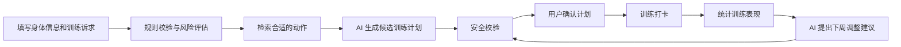

# FitFlow_AI 后续完整项目路线图

## 1. 项目定位

FitFlow_AI 后续应该继续发展成一个可控 AI 健身教练系统，而不是普通的健身计划生成器。

核心定位：

> FitFlow_AI 是一个面向健身新手的 AI Coach 项目，使用 FastAPI + LangGraph + DashScope Qwen，把用户画像、风险评估、训练计划、营养建议、训练反馈、周报调整和人工确认串成一个可控工作流。

项目重点：

- 规则系统负责安全边界。
- LangGraph 负责编排流程。
- LLM 负责解释、总结、对话和生成候选建议。
- 用户确认后，建议才会变成正式计划。

## 2. 当前阶段

当前项目已经完成后端安全底座的大部分内容：

- FastAPI 后端
- 用户画像
- 风险评估
- 营养目标计算
- 训练计划生成
- 训练计划安全校验
- 训练计划历史
- 训练计划解释
- DashScope 千问调用适配器
- LangGraph 训练计划 workflow

当前项目已经具备 proposal、正式计划、基础训练打卡、周报调整和 React PWA。下一阶段重点是把训练记录与计划中的具体训练日绑定，再接入 Exercise Catalog，让 AI 只能从真实动作库中选择动作。

## 2.1 产品闭环与数据流

FitFlow_AI 的目标闭环：



系统处理顺序必须保持为：

```text
用户画像
-> 健康风险规则
-> 动作库筛选
-> AI 编排候选计划
-> 程序校验计划
-> 用户确认
-> 保存正式计划
-> 训练记录
-> 周报和调整 proposal
```

首次使用时，用户画像逐步扩展以下字段：

- 年龄、性别、身高、体重和训练目标。
- 训练经验、每周训练天数和单次训练时长。
- 可用器械。
- 胸痛、急性损伤、关节疼痛等健康风险。
- 不喜欢或无法完成的动作。

训练计划中的动作最终必须使用 Exercise Catalog 的 `exercise_id`。前端通过该 ID 读取动作名称、目标肌肉、器械、动作说明和 GIF；LLM 只负责编排候选方案，不能凭空创造动作。当前动作库尚未接入时，训练记录暂时兼容动作名称，并预留可选 `exercise_id`。

技术职责：

- LangChain 或本地检索服务：按器械、目标肌群和难度筛选动作。
- LangGraph：编排画像读取、风险判断、动作检索、AI 生成和安全校验。
- DashScope Qwen：组合动作、生成结构化候选计划并解释原因。
- Pydantic：校验模型输出和 API 输入。
- 规则层：限制训练天数、动作数量、训练容量、目标 RPE 和危险动作。
- Proposal：保存 AI 候选方案；只有用户批准后才生成正式计划。
## 3. Milestone 2：项目整理与展示基础

目标：把当前后端成果整理成一个面试官能看懂、自己能复现运行的项目。

要做：

- 提交当前 LangGraph workflow 改动。
- 整理 `README.md`。
- 保留完整路线图文档 `docs/fitflow-ai-roadmap.md`。
- 补充架构图，说明 API 层、Workflow 层、Domain 层、Service 层和 Infrastructure 层。
- 明确本地启动、环境变量、接口列表和测试命令。

完成标准：

- 别人打开 GitHub 能明白项目目标。
- 你能根据 README 从零启动项目。
- `python -m pytest -v` 通过。

## 4. Milestone 3：AI Coach Chat 对话接口

目标：让项目从“生成计划”升级成“能对话的 AI 健身教练”。

新增接口：

```text
POST /api/coach/chat
```

用户可以问：

- “我今天腿酸还能练吗？”
- “为什么我的计划是每周 3 天？”
- “我现在想减脂，训练要怎么调整？”
- “这个动作太难，有替代动作吗？”

后端流程：

```text
用户问题
-> 读取用户画像
-> 读取最近训练计划
-> 执行风险规则
-> 组织上下文
-> 调用千问生成回答
-> 返回 answer + safety_level + referenced_plan_id
```

关键原则：

- 大模型不能绕过风险规则。
- 胸痛、急性损伤等高风险输入必须触发安全提醒。
- 默认测试使用 fake provider，不消耗真实 token。
- 设置 `FITFLOW_LLM_PROVIDER=dashscope` 后可以真实调用千问。

## 5. Milestone 4：Proposal 与人工确认机制

目标：实现草案和正式计划分离。

未来流程：

```text
生成 proposal
-> 展示原因、风险和安全校验
-> 用户批准或拒绝
-> 批准后转成正式 active plan
```

新增能力：

- `proposals` 数据模型。
- `POST /api/proposals/{id}/decision`。
- 用户可以批准或拒绝 AI 建议。
- 正式训练计划只由批准后的 proposal 生成。

完成标准：

- 未批准 proposal 不会改变正式计划。
- 批准后生成新的正式计划版本。
- 拒绝后保留用户反馈。

## 6. Milestone 5：训练打卡与反馈闭环

目标：让系统知道用户实际练得怎么样。

新增接口：

```text
POST /api/workouts/{plan_id}/sessions
GET /api/workouts/history
```

记录内容：

- 正式计划 ID 和计划中的训练日。
- 动作 ID（动作库接入前兼容动作名称）。
- 每个动作每一组的重量、次数和 RPE。
- 是否完成训练、整体疲劳程度和疼痛反馈。
- 用户训练备注和安全提醒。

训练页面应当从正式计划自动展开当天动作和预定组数，用户只填写实际完成数据。后端必须校验训练日存在，并避免把不属于该训练日的动作误记入记录。

这些数据后续用于判断计划是否太难、当前重量是否合适、哪个动作长期无法完成、疲劳是否持续上升，以及给周报和 AI Coach 提供真实上下文。

完成标准：

- 可以选择正式计划和具体训练日提交记录。
- 可以记录每一组重量、次数和 RPE。
- 可以按计划查询训练历史。
- 高疼痛或高疲劳反馈会触发安全提醒。
- Exercise Catalog 接入后，训练记录中的动作使用稳定 `exercise_id`。

## 7. Milestone 6：周报与计划调整

目标：实现执行闭环。

每周系统聚合训练数据，生成：

- 完成率
- 平均 RPE
- 疲劳趋势
- 疼痛反馈
- 训练量变化
- 下周调整建议

流程：

```text
训练记录
-> 周报统计
-> 规则校验
-> 生成调整 proposal
-> 用户确认
-> 更新正式计划
```

完成标准：

- 有 `POST /api/reports/weekly`。
- 周报能引用真实训练记录。
- 调整建议必须走 proposal 确认。

## 8. Milestone 7：长期记忆与偏好管理

目标：让 AI Coach 逐渐记住用户偏好。

保存的信息：

- 不喜欢的动作
- 无法使用的器械
- 常见疼痛或限制
- 偏好的训练时间
- 历史调整效果

注意：

- 模型推断出的记忆不能直接覆盖用户明确输入。
- 记忆要有来源，例如来自哪次对话或哪次训练反馈。

完成标准：

- 有用户记忆表。
- Coach Chat 能读取记忆。
- 用户可以查看或删除记忆。

## 9. Milestone 8：Exercise Catalog 与 RAG 健身知识库

目标：让计划中的动作来自真实动作库，让 AI 回答和动作解释有可追溯依据。

第一阶段先接入 `hasaneyldrm/exercises-dataset` 的结构化 JSON：

- 动作 ID、名称、身体部位、目标肌肉和辅助肌肉。
- 所需器械和动作步骤。
- 图片、GIF 或视频路径。
- 数据来源和媒体归属信息。

先实现结构化检索，不急着上向量数据库：

```text
用户画像和训练目标
-> 按可用器械过滤
-> 按目标肌群过滤
-> 排除用户不喜欢或受限动作
-> 返回候选动作
-> LangGraph 交给千问编排计划
```

新增能力：

- `GET /api/exercises/search`：按关键词、器械、身体部位和目标肌肉检索。
- `GET /api/exercises/{exercise_id}`：返回动作说明和 GIF 引用。
- 训练计划中的动作必须引用 Catalog 的 `exercise_id`。
- Coach Chat 回答动作替代问题时引用检索到的动作。

第二阶段再扩展非结构化知识 RAG：

- 新手训练原则、RPE、热身、恢复和安全注意事项。
- 向量检索、metadata 过滤、来源引用和检索质量评估。

注意：代码与文本数据和 GIF/视频媒体可能具有不同授权。项目中必须保留数据来源和媒体归属说明，媒体先用于本地学习与面试演示，商业使用前单独确认授权。

完成标准：

- AI 不会生成动作库之外的动作。
- 前端能通过 `exercise_id` 展示动作说明和 GIF。
- 回答能够说明检索依据和数据来源。
- 高风险问题仍然优先执行安全规则。
## 10. Milestone 9：前端 Demo

目标：让秋招展示更直观。

当前统一使用 React PWA，不再维护第二套前端。

第一版手机端只保留六个主要页面：

1. 用户画像与风险评估。
2. AI 计划生成。
3. Proposal 计划确认。
4. 今日训练。
5. 训练记录。
6. 历史数据与周报。

AI Coach 对话作为全局入口或详情页能力，不单独打断核心训练闭环。当前使用 React + TypeScript PWA 验证手机端流程，并保持电脑端基本响应式适配。

完成标准：

- 面试时可以打开页面演示完整闭环。
- UI 不求复杂，但流程要顺。
- 能展示“AI 不是乱答，而是被规则约束”。

## 11. Milestone 10：工程化、部署与面试包装

目标：把项目从本地开发变成可展示作品。

工程化内容：

- Dockerfile
- docker-compose
- PostgreSQL 替换 SQLite
- 日志记录
- 错误处理
- 简单 trace
- 部署文档

面试材料：

- README
- 架构图
- Demo 截图
- 测试截图
- 接口截图
- 项目亮点总结
- 面试讲解稿

简历描述可以写成：

> 基于 FastAPI + LangGraph + DashScope Qwen 构建 AI 健身教练系统，实现用户画像建模、健康风险评估、训练计划生成、安全规则校验、历史计划管理、对话式问答和训练反馈闭环。系统采用规则引擎约束大模型输出，通过 proposal 与人工确认机制避免 LLM 直接修改正式计划。

## 12. 推荐开发顺序

1. 完成训练记录 2.0：绑定正式计划和训练日、自动展开组记录、查询训练历史。
2. 接入 Exercise Catalog：导入结构化 JSON，建立动作模型、检索接口和媒体引用。
3. 扩展用户画像：训练经验、可用器械、不喜欢或受限动作。
4. 改造训练计划 workflow：检索候选动作，千问只编排 Catalog 中的 `exercise_id`，再执行安全校验。
5. 完善训练打卡：通过 `exercise_id` 展示 GIF 和动作说明，记录每组真实表现。
6. 增强周报调整：统计动作完成率、训练量、RPE 和疲劳趋势，生成调整 proposal。
7. 整理并持续完善 React + TypeScript PWA 的手机端流程。
8. 扩展非结构化知识 RAG、检索评估和来源引用。
9. 完成 Docker、PostgreSQL、日志、部署和秋招面试包装。

当前最高优先级是第 1 项；完成后立即进入 Exercise Catalog，而不是先做更多自由聊天能力。
## 13. 范围控制

第一版不做：

- 摄像头动作识别。
- 姿态纠错。
- 疾病诊断。
- 康复处方。
- 极端减重方案。
- 复杂社交、付费和运营系统。
- 完全自主的多 Agent 自由协商。

这些功能不适合当前秋招项目第一阶段。当前最重要的是把可控 AI 工作流、规则安全边界和可演示闭环做清楚。
